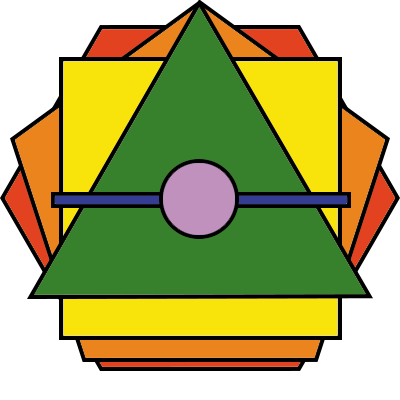

# [polygon.io](https://polygonio.herokuapp.com/)

## Présentation du jeu

polygon.io est un jeu de tir multijoueur inspiré d'agar.io. Le but du jeu est de détruire les autres joueurs en évoluant grâce à l'expérience. Les niveaux de joueurs sont représentés par des polygones : plus le joueur est haut niveau, plus il a de vies et de côtés donc plus son nombre de tir est élevé.

## Structure du projet

Le projet est divisé en trois parties :

-   le client next.js avec une librairie pixi.js ;
-   le serveur node.js herbergé sur Heroku ;
-   la base de données Redis.

Le client next.js s'occupe du front et des composants. La librairie pixi.js permet de gérer le rendu du jeu.

Le serveur node.js s'occupe de la logique du jeu et de la communication avec le client. Il est hébergé sur Heroku. Il utilise la librairie socket.io pour la communication en temps réel avec le client, ainsi que la librairie WebWorker pour le parallélisme.

La base de données (clé-valeur) Redis s'occupe de stocker les données des joueurs et des parties. Elle est hébergée sur Heroku. La base de données . Les données sont compressées grâce à la librairie pako. L'utilisation de la base de données Redis permet de stocker les données en mémoire vive, ce qui permet d'accéder aux données plus rapidement.
